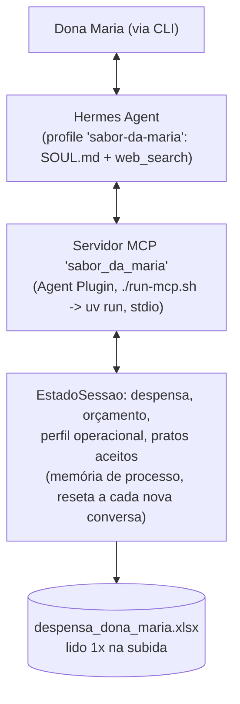
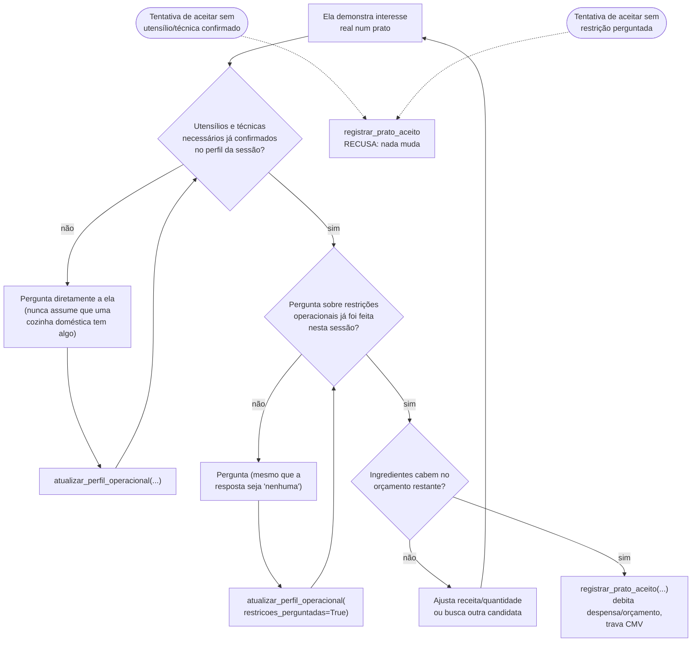

# Sabor da Maria — agente consultor de cardápio e precificação

Agente conversacional, construído sobre o [Hermes Agent](https://github.com/nousresearch/hermes-agent),
que ajuda a Dona Maria (cozinheira abrindo seu primeiro delivery) a ir da
despensa que ela já tem até um cardápio de lançamento precificado. O
agente busca receitas reais que aproveitem o que ela tem, garante que ela
confirma ter os utensílios e a habilidade necessários **antes** de
qualquer compromisso, calcula o que falta comprar dentro de um orçamento
de R$80,00, e propõe cenários de preço de venda com base no CMV real do
prato, nunca em números "estimados de cabeça" pelo modelo.

## 1. Como rodar

> **Requer Linux real**, nativo em Linux/macOS, ou **WSL2 no Windows**.
> Windows nativo tem um bug confirmado: o Hermes usa `os.kill(pid, 0)`
> pra checar se um processo está vivo, mas no Windows isso dispara
> `CTRL_C_EVENT` em vez do no-op POSIX esperado ([bug do próprio
> Python](https://bugs.python.org/issue14484), de 2012, nunca corrigido).
> O Hermes já corrigiu [14
> ocorrências](https://hermes-agent.nousresearch.com/docs/user-guide/windows-native#process-management-internals)
> trocando por `psutil.pid_exists()`, mas
> [`_pid_alive`](https://github.com/NousResearch/hermes-agent/blob/main/tui_gateway/host_supervisor.py#L92)
> (no caminho que sobe o servidor MCP local) ainda chama a versão
> problemática sem guarda, violando a [Critical Rule
> #1](https://github.com/NousResearch/hermes-agent/blob/main/CONTRIBUTING.md#critical-rules)
> do projeto, e mata o subprocesso pouco depois de conectar. Patchear o
> motor corrigiria, mas foge do escopo; WSL2 evita o problema sem tocar
> nele, já que ali `os.kill(pid, 0)` é o no-op inofensivo de sempre. Um
> container Docker com o Hermes completo seria equivalente (mesmo kernel
> POSIX), mas exigiria redistribuir a instalação do Hermes numa imagem do
> projeto, contradizendo o princípio de não tocar/redistribuir o motor
> alheio já usado em outras decisões do projeto.

Este README assume que você já tem o **Hermes Agent instalado** e, por
consequência, já tem o `uv` que o instalador do Hermes traz junto. Nenhum
passo deste repositório instala `uv` nem toca na sua instalação pessoal do
Hermes. Se ainda não tiver o Hermes:

```bash
# Linux ou macOS nativos: nenhum passo extra
curl -fsSL https://hermes-agent.nousresearch.com/install.sh | bash

# Windows: via WSL2 (ver nota acima)
wsl --install   # se ainda não tiver WSL2 (requer reboot)
# dentro do WSL:
curl -fsSL https://hermes-agent.nousresearch.com/install.sh | bash
```

**Passo a passo:**

1. Clone este repositório (Linux/macOS nativos, ou de dentro do WSL no
   Windows):
   ```bash
   git clone https://github.com/LSchafer/case-agente-cardapio.git sabor-da-maria
   ```
   ```bash
   cd sabor-da-maria
   ```
2. Instale como um **Hermes profile isolado**: um `HERMES_HOME` próprio
   (`~/.hermes/profiles/sabor-da-maria/`), que **não toca em nada** da sua
   instalação pessoal do Hermes (ver seção 2):
   ```bash
   hermes profile install .
   ```
   Nenhuma dependência Python precisa ser instalada manualmente: `uv run`
   (embutido no Hermes) cria um ambiente isolado sozinho, dentro do
   próprio profile, **na primeira vez** que uma conversa conectar no servidor
   MCP. **Isso deixa a primeira conversa (ou a primeira depois de rodar
   `install`/`update` de novo) uns 15-20s mais lenta**. Da segunda
   conversa em diante o ambiente já fica persistido e é reaproveitado
   instantaneamente.
3. Configure a chave da OpenAI (modelo padrão escolhido é o `gpt-5.6-luna`, com fallback
   automático para `gpt-5.6-terra`):
   - Copie o template gerado:
     ```bash
     cp ~/.hermes/profiles/sabor-da-maria/.env.EXAMPLE ~/.hermes/profiles/sabor-da-maria/.env
     ```
   - Abra o arquivo pra editar:
     ```bash
     ${EDITOR:-nano} ~/.hermes/profiles/sabor-da-maria/.env
     ```
     Cole sua `OPENAI_API_KEY` (obrigatória) e, se quiser, descomente e
     preencha `TAVILY_API_KEY` (opcional, melhora a busca de receitas). No
     `nano`: salve com `Ctrl+O`, `Enter`, e saia com `Ctrl+X`.
   - Opcional: `TAVILY_API_KEY` no mesmo `.env` melhora a busca de receita
     (mais detalhe na seção 5). Sem ela, a Tavily tem um modo gratuito sem
     chave (mais lento sob uso intenso), então a busca de receitas funciona
     de qualquer forma.
4. Converse:
   ```bash
   hermes -p sabor-da-maria chat
   ```
   (Funciona de qualquer diretório: o profile não depende de onde você
   roda o comando.)

- Para atualizar depois de puxar uma versão nova do repo:
  `hermes profile update sabor-da-maria`.
- Para remover tudo sem deixar resíduo na instalação pessoal:
  `hermes profile delete sabor-da-maria`.
- **Se você deletou e quer reinstalar com o mesmo nome**: bug conhecido do
  próprio Hermes deixa o profile invisível pro CLI depois disso. Rode
  `rm -f ~/.hermes/profiles/.deleted/sabor-da-maria` antes de repetir o
  `hermes profile install .`.

**Evidência automatizada** (opcional, mas útil pra conferir as garantias
financeiras sem depender de uma conversa manual): 82 testes cobrindo
leitura da planilha de despensa, conversão de unidade, CMV/precificação e
os guardrails de estado.
```bash
cd plugins/sabor-da-maria
```
```bash
~/.hermes/bin/uv run --group dev pytest tests -q
```

## 2. Arquitetura da solução

A ideia central é separar duas camadas que nunca se misturam: uma camada
**conversacional** (o LLM, orientado por `SOUL.md`) cuida de busca de
receita, elicitação e apresentação em linguagem natural; e uma camada
**determinística** (um servidor MCP próprio) cuida de qualquer número
financeiro ou de estoque. **O LLM nunca calcula CMV, custo ou conversão de
unidade "de cabeça". LLM sempre delega pra uma tool.** Essa separação existe
pra garantir zero alucinação de número financeiro, um dos requisitos duros
do sistema.



**Como o custo unitário é calculado** (`carregar_despensa`, em
`plugins/sabor-da-maria/mcp_server/planilha.py`): na subida do servidor,
as duas abas do xlsx são cruzadas por nome de ingrediente, `Despensa`
(quantidade em estoque) com `Precos` (quantidade comprada e preço total
pago). A unidade de cada lado é normalizada (kg/g, L/mL, e as 6 unidades
compostas tipo "un 500g", ver seção 5), e só então `custo_unitario =
preço total pago ÷ quantidade comprada`. Isso acontece uma única vez,
inteiramente em código: o mesmo princípio de "nunca calcular de cabeça"
que vale pro CMV vale também pra origem do próprio custo unitário.

**Por que um Hermes profile isolado, não a configuração global do
Hermes.** `hermes profile install .` cria um `HERMES_HOME` inteiramente
separado (`config.yaml`, `.env`, `SOUL.md`, skills, MCP e memórias
próprios). A alternativa mais simples seria registrar o servidor MCP
direto na configuração pessoal de quem instala. Foi rejeitada porque isso
mutaria configuração global de qualquer pessoa que clonasse o repo:
toolsets restritos, modelo, backend de busca e catálogo de skills
passariam a valer pra todo o uso pessoal do Hermes dela, não só pra esta
conversa. Profile isolado resolve isso de raiz: instalar não toca em
**nenhuma** configuração pessoal, e remover é um único comando
(`hermes profile delete sabor-da-maria`).

**Por que um servidor MCP próprio, não editar o Hermes.** Uma capacidade
vira *skill* quando é instrução + comandos de shell + tools que já
existem; vira *tool* quando precisa de lógica de processamento
customizada que é o caso do cálculo de CMV. Registrar uma tool direto no
código-fonte do Hermes exigiria editar o motor em si; o caminho escolhido foi
**MCP**: um servidor Python pequeno e próprio
(`plugins/sabor-da-maria/mcp_server/`, FastMCP, stdio), rodando local como
subprocesso do Hermes, sem hospedagem externa, sem tocar no motor.
(`run-mcp.sh` é um wrapper de uma linha: o manifesto do plugin só aceita um
executável resolvido via `PATH` ou um caminho começando com `./`, nunca um
caminho absoluto, e `uv` não fica no `PATH` do processo do Hermes por
padrão. O script resolve isso em runtime antes de subir o servidor.)

**Por que o estado (despensa, orçamento, perfil) vive no MCP, não na
memória nativa do Hermes.** A memória nativa do Hermes é pensada para
fatos curados e duráveis sobre o usuário, persistindo entre conversas,
e não para estado transacional que precisa ser debitado com precisão a cada
prato aceito. Usá-la vazaria despensa/perfil de uma execução de teste pra
outra do mesmo profile, quebrando a reprodutibilidade que este documento
busca (reset por conversa, ver abaixo). Por isso `EstadoSessao`, dentro
do próprio servidor MCP, é o único lugar onde despensa, orçamento
restante, perfil operacional e histórico de pratos aceitos vivem, em
memória de processo, resetado a cada nova conversa (`hermes -p
sabor-da-maria chat`). **Esse reset é proposital para replicar testes**: mantém cada conversa
reprodutível a partir do mesmo ponto de partida (a planilha original),
sem depender de limpar estado manualmente entre testes.

### Tools do servidor MCP

| Tool | Efeito colateral | Papel |
|---|---|---|
| `consultar_despensa()` | não | lê despensa + orçamento atuais |
| `atualizar_perfil_operacional(...)` | sim (perfil) | registra utensílio/técnica/restrição confirmados, cumulativo na sessão |
| `verificar_viabilidade(...)` | não | simula gap de compra + checklist de pré-requisito |
| `registrar_prato_aceito(...)` | sim (único ponto de mutação) | recalcula tudo, debita despensa/orçamento, trava CMV |
| `calcular_precificacao(prato)` | não | busca o CMV travado, retorna 3 cenários de preço por porção |
| `avaliar_preco_final(prato, preco_proposto)` | não | simula qualquer preço livre contra o CMV travado, repetível |
| `confirmar_preco_final(prato, preco)` | sim (grava o preço) | recalcula o preço proposto do zero e grava como decisão final |
| `consultar_cardapio()` | não | lista pratos aceitos (nome, porções, cmv_por_porcao, preço confirmado, fonte da receita) |

<sub>Efeito colateral = muda `EstadoSessao` (despensa, orçamento ou
perfil) além de retornar um valor. "não" = leitura/cálculo puro sobre o
estado atual, pode ser chamada quantas vezes for preciso sem consequência.</sub>


## 3. Elicitação: o guardrail central do sistema

Antes de qualquer prato ser considerado "aceito", o agente precisa ter
confirmado com a Dona Maria três coisas: que ela **tem os utensílios**
exigidos pela receita, que ela **sabe as técnicas** necessárias, e que
**perguntou sobre restrições operacionais** dela (tempo disponível, tipo
de fogão, o que ela evita cozinhar). O sistema nunca pode deixar ela achar
que vai cozinhar algo e descobrir depois, no meio do preparo, ou pior,
depois de já ter comprado, que falta um utensílio ou uma técnica.

Isso não é só uma instrução de prompt: é validado por código. A tool
`registrar_prato_aceito` (o único lugar do sistema que efetivamente
compromete despensa e orçamento) **recusa e não muda nada** se qualquer um
desses três pontos não tiver sido confirmado antes, através da tool
`atualizar_perfil_operacional`.



**Limite honesto desse guardrail**: ele garante que a pergunta *aconteceu*
antes do compromisso, não que a resposta dela foi *sincera*. Ao contrário da despensa (que tem a
planilha como fonte de verdade independente para cruzar), não existe uma
"planilha de utensílios" pra conferir utensílio/técnica/restrição contra
algo externo.

## 4. Fluxo completo de uma interação

1. Ela pede ajuda pra montar o cardápio. O agente chama
   `consultar_despensa()`, busca receitas reais via `web_search`, via Tavily, e
   apresenta 2 candidatas (nome, ingredientes e quantas porções cada uma
   rende) sem calcular nada ainda.
2. Ao demonstrar interesse real numa candidata: elicitação de
   utensílio/técnica/restrição (seção 3), sempre antes de qualquer número.
3. `verificar_viabilidade(...)` simula o gap de compra: o que ela já tem,
   o que falta comprar e quanto custa, e se cabe no orçamento restante.
   Sem efeito colateral, pode repetir quantas vezes for preciso.
4. Com tudo resolvido e confirmação explícita dela:
   `registrar_prato_aceito(..., porcoes)`: debita despensa e orçamento, e
   trava `cmv_total`/`cmv_por_porcao` (custo por porção, já que ela vende
   porção a porção, não a receita inteira de uma vez).
5. `calcular_precificacao(prato)` retorna 3 cenários de preço por porção
   (lucro-alvo de 30%/50%/80% sobre o custo, com o valor em R$ da taxa de
   10% da plataforma já pronto em cada cenário). Ela escolhe uma opção ou
   propõe um valor livre. Pra valor livre, `avaliar_preco_final` avalia
   contra o custo real e avisa se daria prejuízo, antes de considerar o
   preço fechado. Assim que ela confirmar de vez (opção ou valor livre),
   `confirmar_preco_final(prato, preco)` grava esse preço, pra aparecer
   depois em `consultar_cardapio()`.
6. Volta ao passo 1 pro próximo prato do cardápio, orçamento e despensa já
   refletindo o que foi aceito antes (efeito cumulativo, ver seção 5), até
   ela decidir encerrar. A qualquer momento em que ela peça um resumo do
   que já foi montado, `consultar_cardapio()` é a fonte determinística
   (nome, porções, custo por porção e preço confirmado de cada prato),
   nunca reconstruído da memória da conversa.

## 5. Decisões e definições assumidas

Algumas escolhas não estavam totalmente definidas de antemão e foram
decididas explicitamente:

- **Orçamento (R$80,00) e despensa são estado cumulativo entre pratos.**
  Um cardápio de lançamento normalmente tem mais de um prato, então o
  orçamento não reseta a cada prato aceito, e os ingredientes que saem da
  despensa num prato deixam de estar disponíveis pro próximo.
- **Sem hospedagem externa**: o servidor MCP roda local via stdio, como
  subprocesso do próprio Hermes, nunca como serviço remoto.
- **Cenários de preço por markup sobre o CMV** (30%/50%/80% de
  lucro-alvo), não por food cost % de mercado. Usa só a fórmula de piso
  (`preço ≥ CMV / 0,90`, já contando a taxa de 10% da plataforma).
- **Conversão de unidade (xícara, colher, pitada) e normalização de
  unidade composta da planilha** (6 dos 37 ingredientes vêm com unidade
  tipo "un 500g" ou "balde 2kg") são tabelas determinísticas dentro da
  tool, nunca estimativa do LLM.
- **Busca de receita via Tavily** (chave própria opcional; sem ela, cai no
  modo gratuito sem chave da própria Tavily), não um backend puramente
  de busca sem extração de conteúdo, que forçava o agente a abrir cada
  página manualmente pra ler a receita.
- **Preço final confirmado e URL da receita ficam gravados por prato
  aceito** (`preco_confirmado`/`fonte_url`, expostos via
  `consultar_cardapio()`).
- **Toolsets fora do escopo do fluxo ficam desligados só neste profile**
  (terminal, execução de código, controle de computador, memória nativa,
  geração de imagem, agendamento, subagentes). Isso torna estrutural, por
  configuração, duas garantias que dependeriam só de prompt: nunca cair em
  scraping manual quando a busca falha, e nunca gravar estado na memória
  nativa do Hermes.
- **O self-improvement nativo do Hermes fica desligado só neste profile**:
  sem isso, ele replica periodicamente a conversa pra gerar
  aprendizados, o que pode duplicar o que já está descrito em `SOUL.md` e
  competir por limite de uso com a conversa real. Desligado de propósito
  só na configuração deste profile isolado, nunca de forma global. Num
  cenário de escala real, com múltiplos usuários e memória persistida
  entre sessões, esse mesmo aprendizado incremental poderia ser positivo
  em vez de ruído; aqui ele só compete com o teste porque a sessão é curta
  e o guia (`SOUL.md`) já é fixo.
- **Modelo padrão Luna (GPT-5.6), com fallback automático pra Terra** se
  o primário falhar por limite de taxa, erro de servidor ou conexão.
  Luna foi escolhido como padrão por `tool_search` nativo (o modelo
  escolhe dinamicamente qual tool chamar entre as registradas via
  MCP/toolsets, sem manter todas as definições sempre no contexto),
  custo por token baixo, contexto de ~1M tokens, velocidade nas respostas
  e bom desempenho agêntico (9º lugar no [Terminal-Bench 2.1](https://www.tbench.ai/leaderboard/terminal-bench/2.1),
  75,7% de acurácia, por uma fração do custo do 1º colocado: uma
  relação desempenho/custo competitiva pro tier). Terra entra como rede de
  segurança sob rate-limit, o cenário realista numa conta OpenAI
  nova/tier baixo (ver seção 6), não o caminho esperado numa conta com
  tier maior.

## 6. Limitações conhecidas

- O guardrail de elicitação (seção 3) garante sequência, não veracidade
  (detalhado ali).
- O perfil operacional reseta a cada nova conversa, junto com despensa e
  orçamento (decisão proposital, ver seção 2). Num uso contínuo real, ela
  precisaria reconfirmar isso a cada sessão nova.
- `calcular_precificacao(prato)` busca o CMV pelo nome do prato. Se o
  mesmo nome for aceito duas vezes na mesma sessão, usa sempre o registro
  mais recente, sem histórico de precificação por versão.
- Sem multi-tenancy: o estado é single-sessão por design. Uma versão de
  uso contínuo por múltiplos usuários precisaria de persistência real por
  pessoa, não só em memória de processo.
- **Estado não persiste entre sessões (`hermes` reiniciado)**: reset é
  proposital pra reprodutibilidade de teste, mas seria a primeira
  limitação a resolver num uso contínuo real. A arquitetura já favorece
  essa evolução: todo o estado mutável mora numa única classe
  (`EstadoSessao`), com só dois pontos de mutação e dataclasses simples
  (serializáveis em JSON sem esforço). Persistir exigiria só ler/escrever
  um arquivo no início/fim de cada mutação, não redesenhar nada. A memória
  nativa do Hermes não seria o lugar certo pra isso mesmo assim: tem teto
  de ~1.300 tokens (pequeno demais pra despensa + histórico crescendo ao
  longo de uso real) e é escrita/curada pela própria LLM, reintroduzindo o
  risco de transcrição que a arquitetura de tool determinística existe pra
  eliminar. A decisão em aberto de verdade seria semântica, não técnica:
  quando semear do xlsx original (primeira vez) vs. carregar o estado
  salvo (uso contínuo), com um jeito explícito de resetar se ela quiser
  recomeçar do zero.
- Desligar um toolset garante que a ferramenta não existe pro agente nesta
  sessão. Não é garantia de que uma versão futura do Hermes não introduza
  um toolset equivalente ainda não coberto pela lista atual.
- **`Warning: Unknown toolsets: agent-plugin-sabor-da-maria-...__sabor_da_maria`
  aparece em toda conversa: é inofensivo.** É um falso positivo [conhecido
  e documentado do próprio Hermes](https://github.com/NousResearch/hermes-agent/issues/95529):
  a validação de toolsets roda antes da descoberta de plugins, então
  qualquer toolset vindo de um Agent Plugin (não só o deste projeto) é
  sinalizado como "desconhecido".
- **Latência visível em conta OpenAI recém-criada (tier de uso baixo).**
  O modelo padrão escolhido (gpt-5.6-luna) tem um limite de uso por minuto relativamente baixo numa
  conta nova (200k TPM); sob esse limite, o fallback automático pra um segundo modelo
  entra em ação (comportamento intencional, ver seção 5), mas cada troca
  de modelo custa uma nova tentativa, então a conversa fica visivelmente
  mais lenta nesses momentos. Isso é uma característica da conta usada
  para testar (Tier 1), não do sistema em si: numa conta com limite de uso mais
  alto, esse atraso (retry) não aparece.
